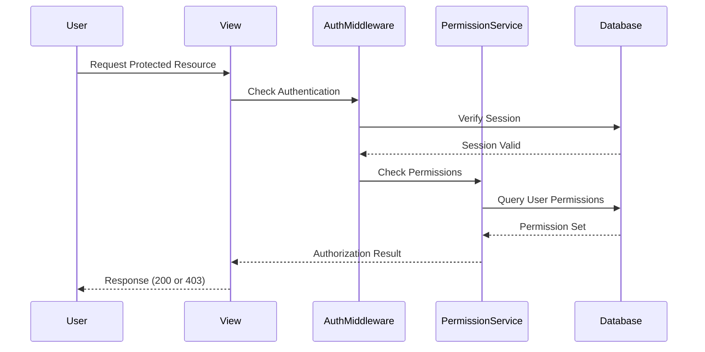

# Design Document

## Overview

This design document outlines a Django-based authentication and authorization system for a multi-user asset tracker application. The system leverages Django's built-in authentication framework, extending it with custom role-based access control (RBAC) to manage user permissions effectively.

The architecture follows Django's MVT (Model-View-Template) pattern and utilizes Django's permission system with custom groups (roles) to provide flexible access control. The system will support admin-managed user creation, role assignment, and granular permission management.

## Architecture

### High-Level Architecture

```
┌─────────────────────────────────────────────────────────────┐
│                     Presentation Layer                       │
│  (Django Templates + Forms for Login, User Management)       │
└─────────────────────────────────────────────────────────────┘
                              ↓
┌─────────────────────────────────────────────────────────────┐
│                      Application Layer                       │
│  (Django Views + Authentication Middleware + Decorators)     │
└─────────────────────────────────────────────────────────────┘
                              ↓
┌─────────────────────────────────────────────────────────────┐
│                       Business Logic                         │
│  (User Management Service + Permission Service)              │
└─────────────────────────────────────────────────────────────┘
                              ↓
┌─────────────────────────────────────────────────────────────┐
│                        Data Layer                            │
│  (Django ORM + User Model + Group Model + Permission Model)  │
└─────────────────────────────────────────────────────────────┘
```

### Component Interaction Flow



## Components and Interfaces

### 1. Authentication Components

#### LoginView
- **Purpose**: Handle user login requests
- **Methods**:
  - `get()`: Display login form
  - `post()`: Process login credentials, create session
- **Dependencies**: Django's `AuthenticationForm`, `authenticate()`, `login()`

#### LogoutView
- **Purpose**: Handle user logout requests
- **Methods**:
  - `post()`: Terminate session, clear authentication data
- **Dependencies**: Django's `logout()`

#### PasswordResetView
- **Purpose**: Handle password reset workflow
- **Methods**:
  - `get()`: Display password reset request form
  - `post()`: Send reset email with token
- **Dependencies**: Django's password reset views, email backend

### 2. User Management Components

#### UserCreateView
- **Purpose**: Admin interface for creating new users
- **Methods**:
  - `get()`: Display user creation form
  - `post()`: Create user with role assignment
- **Permissions Required**: `auth.add_user`
- **Dependencies**: `UserCreationForm`, `Group` model

#### UserListView
- **Purpose**: Display all users with their roles and status
- **Methods**:
  - `get()`: Retrieve and display user list
- **Permissions Required**: `auth.view_user`
- **Dependencies**: `User` model, `Group` model

#### UserUpdateView
- **Purpose**: Admin interface for updating user information
- **Methods**:
  - `get()`: Display user edit form
  - `post()`: Update user data, roles, and status
- **Permissions Required**: `auth.change_user`
- **Dependencies**: `User` model, `Group` model

### 3. Role and Permission Management Components

#### RoleCreateView
- **Purpose**: Create new roles with permission sets
- **Methods**:
  - `get()`: Display role creation form
  - `post()`: Create group with selected permissions
- **Permissions Required**: `auth.add_group`
- **Dependencies**: `Group` model, `Permission` model

#### RoleUpdateView
- **Purpose**: Modify existing roles and their permissions
- **Methods**:
  - `get()`: Display role edit form
  - `post()`: Update group permissions
- **Permissions Required**: `auth.change_group`
- **Dependencies**: `Group` model, `Permission` model

#### PermissionService
- **Purpose**: Centralized permission checking logic
- **Methods**:
  - `user_has_permission(user, permission_codename)`: Check if user has specific permission
  - `get_user_permissions(user)`: Retrieve all permissions for a user (role + individual)
  - `assign_permission_to_user(user, permission)`: Grant individual permission
  - `revoke_permission_from_user(user, permission)`: Remove individual permission

### 4. Middleware and Decorators

#### AuthenticationMiddleware
- **Purpose**: Verify user authentication on each request
- **Behavior**: Attach user object to request, redirect unauthenticated users

#### PermissionRequiredMixin
- **Purpose**: Enforce permission checks on class-based views
- **Usage**: Applied to views requiring specific permissions
- **Behavior**: Return 403 if user lacks required permission

## Data Models

### User Model (Django's Built-in)
```python
User:
  - id: Integer (Primary Key)
  - username: String (Unique)
  - email: String
  - password: String (Hashed)
  - is_active: Boolean
  - is_staff: Boolean
  - is_superuser: Boolean
  - date_joined: DateTime
  - last_login: DateTime
  - groups: ManyToMany(Group)
  - user_permissions: ManyToMany(Permission)
```

### Group Model (Django's Built-in - Used as Roles)
```python
Group:
  - id: Integer (Primary Key)
  - name: String (Unique)
  - permissions: ManyToMany(Permission)
```

### Permission Model (Django's Built-in)
```python
Permission:
  - id: Integer (Primary Key)
  - name: String
  - content_type: ForeignKey(ContentType)
  - codename: String
```

### Session Model (Django's Built-in)
```python
Session:
  - session_key: String (Primary Key)
  - session_data: Text (Encrypted)
  - expire_date: DateTime
```

## Cor
rectness Properties

*A property is a characteristic or behavior that should hold true across all valid executions of a system—essentially, a formal statement about what the system should do. Properties serve as the bridge between human-readable specifications and machine-verifiable correctness guarantees.*

### Property 1: User creation with role assignment
*For any* valid username, email, password, and role, when an admin creates a user account, the system should store the user with the specified credentials and the role should be assigned to the user.
**Validates: Requirements 1.1**

### Property 2: Password hashing invariant
*For any* user creation, the password stored in the database should be hashed and should not match the plaintext password provided during creation.
**Validates: Requirements 1.3**

### Property 3: Email validation enforcement
*For any* invalid email format, attempting to create a user should result in a validation error and no user should be created.
**Validates: Requirements 1.4**

### Property 4: Admin-only user creation
*For any* non-admin user, attempting to create a user account should result in an authorization error (403 Forbidden).
**Validates: Requirements 1.5**

### Property 5: Valid login creates session
*For any* user with valid credentials, successful login should create an authenticated session and the user should be redirected to the dashboard.
**Validates: Requirements 2.1**

### Property 6: Invalid credentials rejection
*For any* invalid credential combination (wrong username or wrong password), login attempts should be rejected with an error message.
**Validates: Requirements 2.2**

### Property 7: Session persistence within timeout
*For any* authenticated session, if accessed before the timeout period expires, the session should remain valid and maintain authentication state.
**Validates: Requirements 2.4**

### Property 8: Session expiration enforcement
*For any* session that exceeds the configured timeout period, the session should be invalidated and require re-authentication.
**Validates: Requirements 2.5**

### Property 9: Logout terminates session
*For any* authenticated user, performing logout should terminate the session and clear all authentication data.
**Validates: Requirements 3.1**

### Property 10: Unauthenticated access redirection
*For any* protected view, when accessed by an unauthenticated user, the system should redirect to the login page.
**Validates: Requirements 3.3**

### Property 11: Role creation with permissions
*For any* valid role name and permission set, when an admin creates a role, the system should store the role with all specified permissions.
**Validates: Requirements 4.1**

### Property 12: Role assignment grants permissions
*For any* user and role, when the role is assigned to the user, the user should have all permissions associated with that role.
**Validates: Requirements 4.2**

### Property 13: Role removal revokes permissions
*For any* user with an assigned role, when the role is removed from the user, the user should no longer have the role's permissions (unless granted individually).
**Validates: Requirements 4.3**

### Property 14: Role permission updates propagate
*For any* role with assigned users, when the role's permissions are modified, all users with that role should reflect the updated permission set.
**Validates: Requirements 4.4**

### Property 15: Admin-only role management
*For any* non-admin user, attempting to create, modify, or delete roles should result in an authorization error (403 Forbidden).
**Validates: Requirements 4.5**

### Property 16: Individual permission assignment
*For any* user and permission, when an admin assigns the permission to the user, the permission should be added to the user's individual permission set.
**Validates: Requirements 5.1**

### Property 17: Individual permission revocation
*For any* user with an individual permission, when the permission is revoked, it should be removed from the user's permission set.
**Validates: Requirements 5.2**

### Property 18: Permission union from multiple sources
*For any* user, the effective permissions should be the union of permissions from assigned roles and individual permissions.
**Validates: Requirements 5.3, 5.4, 6.4**

### Property 19: Access control enforcement
*For any* protected view requiring specific permissions, users with the required permission should be granted access (200 OK), while users without the permission should be denied access (403 Forbidden).
**Validates: Requirements 6.1, 6.2**

### Property 20: User list completeness
*For any* set of users in the system, when an admin requests the user list, all users should be displayed with their roles and status information.
**Validates: Requirements 7.1**

### Property 21: Deactivation prevents login
*For any* user account, when deactivated by an admin, login attempts with that user's credentials should be rejected.
**Validates: Requirements 7.2**

### Property 22: Reactivation restores access (round-trip)
*For any* user account, deactivating and then reactivating should restore the user's ability to log in.
**Validates: Requirements 7.3**

### Property 23: User update preserves integrity
*For any* user and valid update data, when an admin updates the user information, the changes should be saved and other user data should remain unchanged.
**Validates: Requirements 7.4**

### Property 24: Admin-only user management
*For any* non-admin user, attempting to access user management functions (list, create, update, deactivate) should result in an authorization error (403 Forbidden).
**Validates: Requirements 7.5**

### Property 25: Password reset token generation
*For any* user requesting a password reset, the system should generate a valid reset token and send it to the user's registered email.
**Validates: Requirements 8.1**

### Property 26: Password reset updates and invalidates token
*For any* valid reset token and new password, submitting the password reset should update the user's password and invalidate the reset token.
**Validates: Requirements 8.3**

### Property 27: Password reset invalidates all sessions
*For any* user with active sessions, completing a password reset should invalidate all existing sessions for that user.
**Validates: Requirements 8.5**

## Error Handling

### Authentication Errors
- **Invalid Credentials**: Return clear error message without revealing whether username or password was incorrect (security best practice)
- **Account Deactivated**: Return specific error message indicating account is inactive
- **Session Expired**: Redirect to login page with message indicating session timeout

### Authorization Errors
- **Insufficient Permissions**: Return HTTP 403 Forbidden with clear message about missing permissions
- **Unauthenticated Access**: Redirect to login page with next parameter to return after login

### Validation Errors
- **Invalid Email Format**: Display field-level validation error on form
- **Duplicate Username**: Display field-level validation error indicating username is taken
- **Weak Password**: Display validation error with password requirements
- **Missing Required Fields**: Display field-level errors for all missing fields

### System Errors
- **Database Connection Failure**: Log error, display generic error message to user
- **Email Service Failure**: Log error, inform user that password reset email could not be sent
- **Session Storage Failure**: Log error, fall back to database-backed sessions

## Testing Strategy

### Unit Testing Approach

Unit tests will verify specific examples and integration points:

- **Authentication Flow Examples**:
  - Test login with specific valid credentials
  - Test login with specific invalid credentials
  - Test logout clears session data
  
- **User Management Examples**:
  - Test creating a user with specific role
  - Test updating specific user fields
  - Test deactivating and reactivating specific user

- **Role Management Examples**:
  - Test creating a role with specific permissions
  - Test assigning specific role to user
  - Test modifying role permissions

- **Permission Examples**:
  - Test assigning specific individual permission
  - Test checking specific permission on user

- **Edge Cases**:
  - Test duplicate username rejection (Property 2 edge case from 1.2)
  - Test expired password reset token (Property edge case from 8.4)
  - Test empty/whitespace inputs
  - Test SQL injection attempts in username/password fields

### Property-Based Testing Approach

Property-based tests will verify universal properties across all inputs using **Hypothesis** (Python's property-based testing library):

- **Configuration**: Each property test will run a minimum of 100 iterations with randomly generated inputs
- **Tagging**: Each property test will include a comment tag in the format: `# Feature: django-auth-permissions, Property {number}: {property_text}`
- **Coverage**: Each of the 27 correctness properties listed above will be implemented as a single property-based test

**Property Test Categories**:

1. **User Creation Properties** (Properties 1-4):
   - Generate random valid user data and verify creation with role assignment
   - Generate random invalid emails and verify rejection
   - Generate random non-admin users and verify authorization denial

2. **Authentication Properties** (Properties 5-10):
   - Generate random valid/invalid credentials and verify login behavior
   - Generate random session timeouts and verify expiration logic
   - Generate random protected URLs and verify redirection

3. **Role Management Properties** (Properties 11-15):
   - Generate random role names and permission sets
   - Generate random role assignments and verify permission propagation
   - Generate random role modifications and verify updates to all users

4. **Permission Properties** (Properties 16-19):
   - Generate random permission assignments and revocations
   - Generate random users with various permission sources and verify union
   - Generate random access attempts and verify enforcement

5. **User Management Properties** (Properties 20-24):
   - Generate random user sets and verify list completeness
   - Generate random activation/deactivation sequences
   - Generate random user updates and verify integrity

6. **Password Reset Properties** (Properties 25-27):
   - Generate random password reset requests and verify token generation
   - Generate random password updates and verify session invalidation

**Test Data Generators**:
- Username generator: random alphanumeric strings (3-30 chars)
- Email generator: valid and invalid email formats
- Password generator: various strengths and formats
- Permission generator: random permission codenames
- Role generator: random role names with permission sets

### Integration Testing

Integration tests will verify end-to-end workflows:
- Complete user creation workflow from admin interface
- Complete login-to-logout user journey
- Complete password reset workflow
- Role assignment and permission verification workflow

### Test Environment

- **Database**: SQLite for unit/property tests (in-memory for speed)
- **Test Framework**: Django's TestCase with Hypothesis for property tests
- **Coverage Target**: 90%+ code coverage
- **CI/CD**: Run all tests on every commit

## Security Considerations

### Password Security
- Use Django's PBKDF2 password hasher (default)
- Enforce minimum password strength requirements
- Never log or display passwords in plaintext

### Session Security
- Use secure session cookies (HTTPS only in production)
- Implement CSRF protection on all forms
- Set appropriate session timeout (default: 2 weeks)
- Regenerate session ID on login to prevent fixation attacks

### Authorization Security
- Always check permissions on server-side (never trust client)
- Use Django's permission decorators and mixins consistently
- Implement principle of least privilege for role design

### Input Validation
- Validate and sanitize all user inputs
- Use Django's form validation framework
- Protect against SQL injection (Django ORM handles this)
- Protect against XSS (Django templates auto-escape)

## Performance Considerations

### Database Optimization
- Index username and email fields for fast lookups
- Use select_related() for user-role queries to avoid N+1
- Cache permission checks for frequently accessed resources

### Session Management
- Use database-backed sessions for multi-server deployments
- Consider Redis for session storage in high-traffic scenarios
- Implement session cleanup task to remove expired sessions

## Deployment Considerations

### Environment Configuration
- Use environment variables for sensitive settings (SECRET_KEY, database credentials)
- Configure email backend for password reset functionality
- Set DEBUG=False in production
- Configure ALLOWED_HOSTS appropriately

### Initial Setup
- Create superuser account for initial admin access
- Define initial roles and permissions
- Configure session timeout based on security requirements
- Set up email service for password resets

### Monitoring
- Log authentication failures for security monitoring
- Monitor session creation/destruction rates
- Track permission denial events
- Set up alerts for unusual authentication patterns
